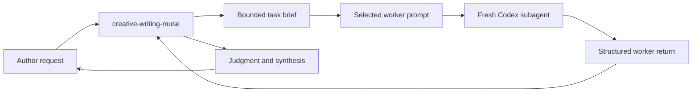
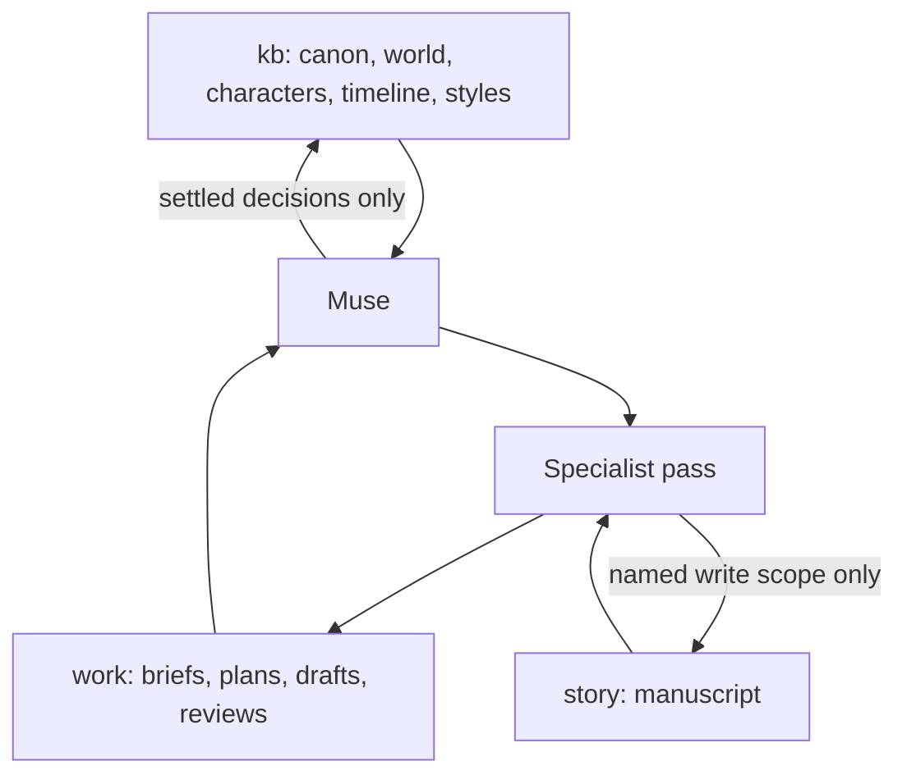
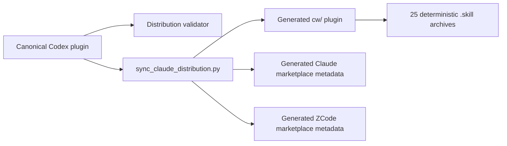

# Plugin Architecture

Creative Writing Skills is a Codex-first plugin with one canonical runtime and
a generated Claude compatibility distribution.

## Runtime Flow

The muse owns the author-facing conversation and the final judgment. Worker
prompts are reusable resources, not independently installed Codex agents.



The canonical worker registry and prompts live under
`plugins/creative-writing-skills/skills/creative-writing-muse/resources/workers/`.
Each registry entry declares its prompt, craft skills, write-access boundary,
and Claude compatibility settings.

The muse selects the smallest composition that fits the task:

| Worker | Responsibility |
|---|---|
| `brainstormer` | Divergent options before commitment |
| `outliner` | Arc, chapter, scene, and beat structure after direction settles |
| `writer` | Fresh drafting, revision, bridges, alternatives, and line polish |
| `critic` | Focused adversarial craft diagnosis |
| `editor` | Holistic editorial priorities across structure, voice, and line quality |
| `reader-sim` | Persona-bound felt reading experience |
| `continuity-checker` | Canon, timeline, terminology, and contradiction checks |
| `character-sim` | In-character voice and relationship exploration |
| `style-creator` | Style-reference extraction from prose samples |
| `web-researcher` | Bounded external research when current sources are required |

Independent workers may run in parallel when they do not share mutable state.
Dependent stages stay sequential:

```text
muse → writer → critic/editor/reader-sim/continuity-checker → muse → writer
```

Review workers do not edit prose. The muse reads every return and never
forwards an unjudged worker report as its final answer. When subagents cannot
run, the muse loads the same worker prompt as a bounded current-context stance
and retains the same sequence and decision boundaries.

## Skill and Artifact Layers

Skills provide the methodology used by muse and workers. Story artifacts
remain ordinary Markdown owned by the author:



Planning output remains provisional until the author confirms it. World
creation reads story prose but does not patch it. Story-memory updates follow
settled decisions and cite their supporting story or project artifacts.

## Distribution Flow

`plugins/creative-writing-skills/` is the only source of truth. The canonical
plugin manifest owns version and identity metadata. The Claude generator
performs explicit syntax and orchestration transformations and replaces the
committed compatibility tree transactionally.



Generated outputs are:

- `cw/skills/` from canonical skills;
- `cw/agents/` from the worker registry and prompts;
- `cw/.claude-plugin/plugin.json` from canonical metadata;
- `cw/.zcode-plugin/plugin.json`, the ZCode plugin manifest;
- `.claude-plugin/marketplace.json` for Claude marketplace compatibility;
- `marketplace.json` at the repository root for ZCode marketplace
  compatibility;
- `zips/*.skill` from the generated Claude skill tree.

Do not hand-edit `cw/`. Change the canonical plugin, run
`python3 scripts/sync_claude_distribution.py --apply`, and commit the canonical
and regenerated results together.

## Release Boundary

`plugins/creative-writing-skills/.codex-plugin/plugin.json` is the sole version
source. `scripts/release.py` requires a clean `main` branch, rejects an
existing next-version tag, updates the canonical manifest, regenerates the
Claude and ZCode metadata, runs the complete verification chain, and only then
commits and tags. It never pushes unless `--push` is supplied; that push sends
the branch and tag atomically.
